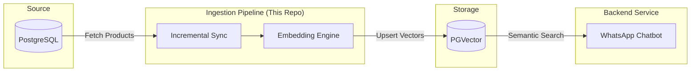

# 🍏 WhatsApp Commerce RAG Ingestion Pipeline

[](https://www.python.org/downloads/release/python-3110/)
[](https://www.docker.com/)
[](https://github.com/pgvector/pgvector)
[](https://openai.com/)

The **Intelligent Brain** for [WhatsApp Commerce SaaS](https://github.com/Jsancmot/whatsapp-commerce-backend). 

This service synchronizes the company's product catalog from PostgreSQL into a **PGVector** store, enabling lightning-fast **semantic search** for the WhatsApp chatbot. It uses a sophisticated **incremental synchronization** strategy to keep embeddings up-to-date while minimizing API costs.

---

## 🏗️ System Architecture

The ingestion pipeline acts as the sole **writer** for the vector store, while the backend service remains a **read-only** consumer. This separates the heavy computational task of embedding generation from the real-time chat logic.



---

## ✨ Key Features

- **🚀 Incremental Synchronization**: Only processes new or modified products. Uses a 3-way diff between SQL, Sync State, and Vector Store.
- **⚡ Event-Driven Triggering**: Optional FastAPI server allows the backend to notify the pipeline for immediate re-indexing when a product is edited.
- **🍏 Cost-Efficient Embeddings**: Uses OpenAI's `text-embedding-3-small` in production for high performance at a fraction of the cost.
- **🛠️ Local-First Development**: Seamlessly switches to **Ollama** (`nomic-embed-text`) for local development, providing a $0 cost environment.
- **🧪 Idempotent Operations**: Uses deterministic Document IDs to prevent duplicates and ensure consistency even after failures.

---

## ⏱️ Execution Modes

| Mode | Environment Variable | Best For |
|---|---|---|
| **One-Shot** | `SCHEDULE_INTERVAL_MINUTES=0` | CI/CD, CronJobs, or manual runs. |
| **Scheduler** | `SCHEDULE_INTERVAL_MINUTES=N` | Background polling of the DB for changes. |
| **Active Listener** | `API_ENABLED=true` | Real-time updates triggered via POST requests from the backend. |

---

## 🚀 Quickstart

1.  **Configure Environment**:
    ```bash
    cp .env.example .env
    # Edit .env — key settings:
    #   ENVIRONMENT=LOCAL        → uses Ollama (free, no API key needed)
    #   ENVIRONMENT=DEVELOPMENT  → uses OpenAI (requires OPENAI_API_KEY)
    ```

    > **LOCAL mode prerequisite**: Ollama must be running on your host machine
    > *before* starting Docker. Pull the embedding model once:
    > ```bash
    > ollama pull nomic-embed-text
    > ```

2.  **Start with Docker**:
    The pipeline includes a health-checked PostgreSQL with `pgvector` pre-installed.
    ```bash
    docker compose up --build
    ```

3.  **Force Full Re-index**:
    If you change embedding models or want to clear the store:
    ```bash
    # Uncomment the --force command in docker-compose.yml or run:
    docker compose run ingestion python -m ingestion.main --force
    ```

---

## ⚙️ Configuration Reference

### Core Settings
| Variable | Default | Description |
|---|---|---|
| `ENVIRONMENT` | `LOCAL` | `LOCAL`, `DEVELOPMENT`, `PRODUCTION`. |
| `DATABASE_URL` | - | PostgreSQL connection string. |
| `COLLECTION_NAME` | `whatsapp_commerce_rag` | Dedicated collection name in PGVector. |

### AI & Models
| Variable | Default | Description |
|---|---|---|
| `OPENAI_API_KEY` | - | Required for non-LOCAL environments. |
| `OLLAMA_BASE_URL` | `http://host.docker.internal:11434` | Your local Ollama instance URL. |
| `OLLAMA_EMBED_MODEL` | `nomic-embed-text` | Model for local embeddings ($0 cost). |

### Triggering & Pipeline
| Variable | Default | Description |
|---|---|---|
| `SCHEDULE_INTERVAL_MINUTES` | `0` | If > 0, the service polls for changes. |
| `API_ENABLED` | `false` | Enables the FastAPI server on port 8001. |
| `INGEST_STORE_SETTINGS` | `true` | Also index store FAQs and general info. |

---

## 🧪 Embedding Strategy

| Environment | Provider | Model | Precision | Cost |
|---|---|---|---|---|
| **Local** | Ollama | `nomic-embed-text` | High | Free |
| **Production** | OpenAI | `text-embedding-3-small` | State-of-the-Art | ~$0.02 / 1M tokens |

> [!CAUTION]
> **Vector Incompatibility**: Embeddings from Ollama and OpenAI are not interchangeable. Switching providers requires a full re-index using the `--force` flag.

---

## 🔧 Troubleshooting

### `Failed to connect to Ollama` in LOCAL mode

This error means the ingestion container can't reach Ollama on your host machine.

| Check | Command |
|---|---|
| Ollama is running | `curl http://localhost:11434` → should return `Ollama is running` |
| Model is downloaded | `ollama list` → should include `nomic-embed-text` |
| Docker can reach host | `docker run --rm curlimages/curl curl http://host.docker.internal:11434` |

The most common cause is a **timing issue**: the container starts before Ollama has fully loaded the model into memory. Simply re-running `docker compose up` usually resolves it.

---

## 📖 Deep Dive Documentation

- 📊 [**Pipeline Flow Diagram**](docs/flow_rag_ingestion.excalidraw) — Visual breakdown of the logic.
- 📄 [**Step-by-Step Explanation**](docs/flow_rag_ingestion.md) — Detailed technical deep dive into every pipeline stage (from diff calculation to idempotent upserts).

---

## 🛠️ Development & Iteration

Most logic is found in the `ingestion/` directory:
- `pipeline.py`: Main orchestration logic.
- `chunking.py`: Customize how product text is grouped (sliding window vs. semantic).
- `embeddings.py`: Manage AI provider configurations.
- `main.py`: Entrypoint and execution mode handling.

---

*Built with ❤️ for the WhatsApp Commerce Ecosystem.*

